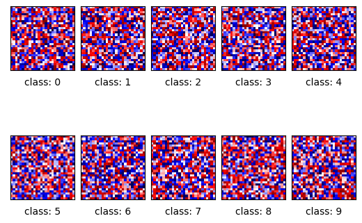
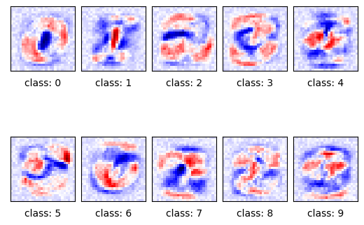

# MNIST Digit Classifier

This project implements a neural network to classify handwritten digits from the **MNIST dataset**.

The main highlight is the **visualization of the model parameters before and after training**. This demonstrates how the network learns to represent each digit:

- **Before training** → weights are random and do not resemble any digit.  
- **After training** → weights adapt and begin to resemble the digits they are meant to identify.

## Visualization

| Before Training | After Training |
|-----------------|----------------|
|  |  |

These images clearly show how the network parameters evolve to encode meaningful patterns, illustrating the learning process in action.
