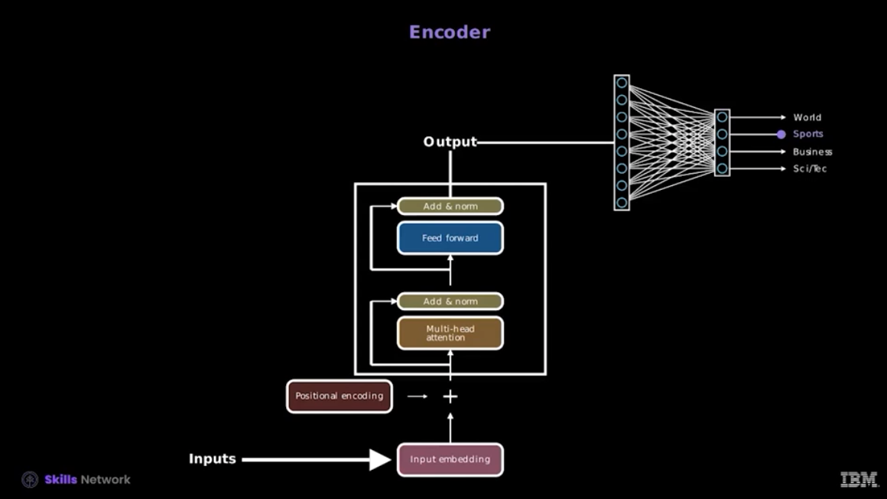
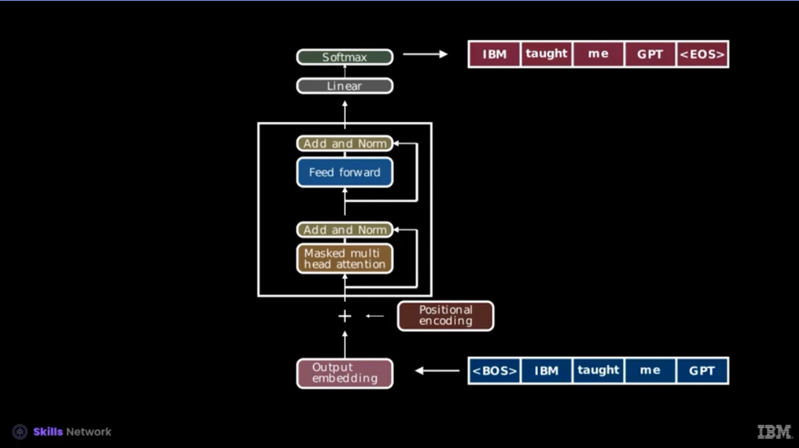
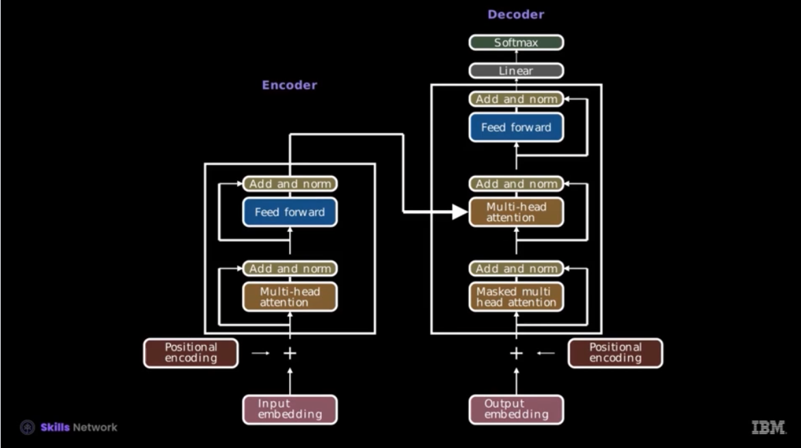

## Inside a Transformer

Transformers refine embeddings layer by layer.

1. **Tokenization** → Break input into tokens.  
2. **Embedding Layer** → Map tokens into vectors.  
3. **Positional Encoding** → Add order information.  
    - Transformers have no built-in notion of word order, so **positional encoding** injects sequence position into embeddings.
    - Typically uses **sine and cosine functions** of different frequencies:
      $$
      PE_{(pos, 2i)} = \sin\left(\frac{pos}{10000^{2i/d_{model}}}\right), \quad
      PE_{(pos, 2i+1)} = \cos\left(\frac{pos}{10000^{2i/d_{model}}}\right)
      $$
      where `pos` is the token position and `i` is the embedding dimension index.
    - These vectors are **added to the word embeddings**, so each token vector contains both meaning and position.
    - Can also be implemented as **learnable parameters**, allowing the model to optimize positional information during training.
        - Instead of fixed sin/cos values, each position has a learnable embedding vector of the same dimension as token embeddings.
4. **Self-Attention Block**  
    - Attention updates embeddings based on context, enabling precise meaning.
    - It allows information transfer between distant tokens
    - Formula:
      $$
      \text{Attention}(Q,K,V) =
      \text{softmax}\\left(\frac{QK^T}{\sqrt{d_k}}\right)V
      $$
    - Multi-head attention captures different relationships.
5. **Feed-Forward Block (MLP)** → Independent nonlinear transformations.  
6. **Stacking Layers** → Repeat attention + MLP many times.  
7. **Final Vector** → Context-rich representation.  

---

## Encoder vs Decoder Transformers

Transformers can be built using **encoders**, **decoders**, or both. The choice determines whether a model is better at *understanding* or *generating* language.

### Encoder-Only Models (e.g., BERT)
- **Architecture:** Based only on the Transformer **encoder**.
- **Attention:** Fully bidirectional – each token can attend to tokens both before and after it.
- **Training Objective:** Masked Language Modeling (MLM), where random words are masked and predicted from context. Original BERT also used Next Sentence Prediction (NSP) to learn sentence relationships.
- **Strength:** Excellent at *understanding language* by learning deep contextual embeddings.
- **Common Use Cases:**
    - Text classification (e.g., sentiment, intent detection)
    - Named Entity Recognition (NER)
    - Question Answering (extractive QA)
    - Semantic similarity and search

### Decoder-Only Models (e.g., GPT)
- **Architecture:** Based only on the Transformer **decoder**.
- **Attention:** Unidirectional (causal) – each token can only attend to tokens **before** it.
- **Training Objective:** Autoregressive Language Modeling, predicting the next word given the sequence so far.
- **Strength:** Excellent at *generating coherent language* by extending text naturally.
- **Common Use Cases:**
    - Chatbots and conversational AI
    - Text generation (stories, code, articles)
    - Summarization and translation (when fine-tuned)
    - Autocomplete systems
- GPT uses trainable positional encodings. Unlike fixed positional encodings (such as sinusoidal encodings used in the original Transformer paper), trainable positional encodings are learned during the model training process.
- The key difference between the training and inference stages lies in the inputs to the decoder. During training, the decoder benefits from exposure to the ground truth--receiving the exact target sequence tokens incrementally through a technique known as "teacher forcing." This approach is in stark contrast to some other neural network architectures that rely on the network's previous predictions as inputs during training. Once training concludes, the datasets used resemble those employed in more conventional neural network models, providing a familiar foundation for comparison and evaluation.
- During training, the target language text (the correct output sequence) is also tokenized and converted into numerical tokens. "Teacher forcing" is a training technique where the decoder is provided with the target tokens as input. The decoder uses both the encoder's output and the previously generated tokens (starting with a special start-of-sequence token) to predict the next token in the sequence.

### Encoder–Decoder Models (e.g., T5, BART)
- Combine an **encoder** (understanding input) and a **decoder** (generating output).
- More flexible, suitable for tasks that require both comprehension and generation.
- **Common Use Cases:** Translation, abstractive summarization, text-to-text tasks.

---

## Teacher Forcing in Transformers

Teacher forcing is a training technique originally developed for RNNs and sequence-to-sequence models.  
- **In RNNs:** At each step, the model can be fed either its own previous prediction or the correct ground-truth token. Teacher forcing means always giving the ground truth, which stabilizes training but creates *exposure bias* (the model never practices recovering from its own mistakes).  

- **In Transformers:** The principle is applied more cleanly thanks to parallelization.  
  - **Decoder-only models (e.g., GPT):** During training, the full target sequence is shifted by one token. The model predicts each next token while always conditioning on the correct previous tokens, not its own guesses.  
  - **Encoder–decoder models (e.g., T5, BART):** The decoder receives both the encoder’s outputs and the shifted ground-truth target tokens as input.  
  - This means Transformers are always trained with the equivalent of teacher forcing, but without step-by-step manual feeding as in RNNs.  

- **Difference from RNNs:** In RNNs, teacher forcing is an explicit option that must be applied during sequential training. In Transformers, the architecture and training objective (shifted targets + masking) *bake in* teacher forcing by default.  

- At inference time, ground truth is unavailable, so the model must autoregressively generate tokens based on its own previous predictions. This shift is what sometimes leads to exposure bias.

---

## Masking

- During training, the model predicts the next token after every subsequence, not just the full context.
- To avoid “cheating,” later tokens must not influence earlier ones.
- Solution: before softmax, set invalid entries to –∞ → they become zero after softmax while keeping normalization intact.
- Always applied in GPT models, even at inference time.

---

## The Attention Mechanism

### Core Idea  
Attention allows the model to determine **which tokens in a sequence should influence each other** when building contextual meaning. Instead of treating each word embedding in isolation, attention selectively passes information between tokens based on their relevance.

- Formula:
  $$
  \text{Attention}(Q,K,V) =
  \text{softmax}\\left(\frac{QK^T}{\sqrt{d_k}}\right)V
  $$

---

### Queries, Keys, and Values  
For each token embedding $e$:  

- **Query ($q$):** What information this token is looking for.  
- **Key ($k$):** What information this token can provide.  
- **Value ($v$):** The actual information passed on if a key matches a query.  

Each is computed through learned weight matrices:  

\[
q = W_q \cdot X,\quad k = W_k \cdot X,\quad v = W_v \cdot X
\]

The **attention score** between two tokens is the dot product $q \cdot k$.  
- Larger scores → higher relevance.  
- Apply **softmax** to normalize scores into probabilities.  
- Use these as weights to form a weighted sum of values:  

\[
\text{Attention}(Q, K, V) = \text{softmax}\left(\frac{QK^T}{\sqrt{d_k}}\right) V
\]

Here $d_k$ is the dimension of the key/query space, added for numerical stability.  

---

### Single-Head Attention  
- Computes **one attention pattern** across the sequence.  
- Updates embeddings by aggregating relevant information (e.g., adjectives modifying nouns).  
- Limitation: one head can only capture a single type of relationship at a time.  

---

### Multi-Head Attention  
- Runs many independent attention heads in parallel.  
- Each head has its own $W_q$, $W_k$, and $W_v$ matrices → learns different contextual relationships.  
- Example:  
  - One head tracks subject–verb agreement.  
  - Another detects long-range references (e.g., *Harry* + *wizard* → *Harry Potter*).  
- Outputs from all heads are concatenated and transformed by an output matrix.  
- GPT‑3 uses **96 heads per block**.  

---

### Self-Attention vs Cross-Attention
- **Self-Attention:** Each token attends to other tokens in the same sequence. Captures intra-sequence relationships.
- **Cross-Attention:** Tokens in one sequence (e.g., decoder input) attend to tokens in another sequence (e.g., encoder output). Integrates information across sequences.
    - computes attention score between target and source positions
    - Cross-attention help to attend to the encoder hidden representation

### How Single-Head and Multi-Head Fit
- **Single-Head Attention:** Computes one attention pattern at a time; basic building block.
- **Multi-Head Attention:** Combines multiple heads in parallel; each head captures a different type of relationship. Concatenated outputs give richer contextual embeddings.
- Self-attention or cross-attention can each use **single-head or multi-head** setups depending on model design.

---

### Stacking Multiple Layers  
- Attention isn’t applied once, but repeatedly in a stack of layers.  
- Each layer refines embeddings further using the outputs of the previous one.  
- GPT‑3 has **96 layers**, each containing multi-headed attention + feedforward layers.  
- Early layers capture simpler patterns (e.g., local syntax), while deeper layers encode **abstract concepts** like tone, style, and factual relationships.  

---

## The Multi-Layer Perceptron (MLP)  

### Role in Transformers  
In transformers, each token embedding repeatedly flows through two key components:  
- **Attention**, which lets embeddings exchange context.  
- **MLPs**, which independently transform each embedding to enrich meaning and store knowledge.  

While attention gets most of the attention, a **majority of the model’s parameters live inside the MLPs**. Research (e.g., from Google DeepMind) suggests that many of the model’s **factual associations** — like *Michael Jordan → basketball* — are encoded in these MLP layers.  

---

### Structure of an MLP Block  
Each MLP block processes each token embedding independently:  

1. **Up Projection (Expansion)**  
    - Multiply the embedding $E$ by a large learned weight matrix $W_{up}$ and add a bias $B_{up}$.  
    - Expands the vector into a much higher-dimensional space (e.g., 4× the embedding size in GPT‑3).  
    - Each row can be thought of as asking: *Does this embedding contain feature X?*  
    - Produces an intermediate vector of "neuron activations".  

2. **Non-Linearity (ReLU or GELU)**  
    - Apply an elementwise non-linear function.  
    - ReLU maps negative values to 0 and keeps positives unchanged.  
    - Acts like an **AND gate**, only triggering when certain combinations of features are present.  
    - Example: One neuron could activate only when the embedding encodes both “Michael” and “Jordan”.  

3. **Down Projection (Compression)**  
    - Multiply by another learned matrix $W_{down}$ and add bias $B_{down}$.  
    - Projects back to the original embedding dimension.  
    - Columns of $W_{down}$ can be thought of as **directions to add back into the embedding** when the corresponding neuron fires.  
    - Example: The neuron triggered by “Michael Jordan” could add the *basketball* direction.  

4. **Residual Connection**  
    - The output is added back to the original embedding, refining it while preserving context.  

---

### How Facts Can Be Stored  
- Assume there are specific high-dimensional directions for **Michael**, **Jordan**, and **basketball**.  
- The MLP can learn:  
  - Detect when an embedding encodes both Michael + Jordan (via $W_{up}$ and ReLU).  
  - Activate a neuron that adds the basketball direction (via $W_{down}$).  
- Result: The output embedding carries the encoded fact that *Michael Jordan plays basketball*.  

---

### Superposition  
A natural question: does each neuron cleanly represent a feature like *Michael Jordan*?  
Evidence suggests the answer is **no** — and that’s actually beneficial.  

- **Key Idea**: In high dimensions, you can store far more features if you allow them to overlap slightly.  
- This is called **superposition**: features are stored as combinations of neurons rather than isolated ones.  

**Why it works**  
- In an n-dimensional space, you can fit only n perfectly perpendicular directions.  
- But if you allow directions to be *nearly* perpendicular (e.g., 89–91°)
- The number of vectors you can cram into a space that are nearly perpendicular grows exponentially with the number of dimensions.
- The Johnson–Lindenstrauss lemma shows that high-dimensional spaces can pack huge numbers of nearly-orthogonal vectors.  

**Example**  
- In a 100-dimensional space, you can randomly generate 10,000 vectors that are all close to perpendicular.  
- With optimization, they can span many thousands of features while remaining almost independent.  
features**.  
- Features are distributed across combinations of neurons, not isolated units.  
- This explains both why LLMs scale so well and why their internals are hard to interpret.  

Researchers often use **sparse autoencoders** to uncover these hidden superposed features.  

---

### Summary  
- **MLPs** in transformers are the main storage for knowledge and facts.  
- Each block uses:  
  - Up Projection → Non-Linearity → Down Projection → Residual Connection.  
- **Parameter count**: ~116 billion in GPT‑3, making them the largest part of the model.  
- **Superposition** allows packing far more features into the network than its raw dimensionality suggests.  

---

## Applications of Transformers

Transformers extend far beyond text:

- **Text → Text**: ChatGPT, summarizers, translators.  
- **Text → Image**: DALL·E, MidJourney.  
- **Image → Text**: Captioning, visual question answering.  
- **Audio → Text**: Whisper.  
- **Text → Audio**: Synthetic voices.  
- **Multimodal**: GPT-4 Vision, combining text + images.  
- **Science**: protein folding (AlphaFold), drug discovery.

---

## Optimization Techniques for Efficient Transformer Training

Training transformers is costly, but several techniques improve efficiency:

### Gradient Accumulation
- Accumulates gradients over mini-batches before updating.
- Enables larger effective batch sizes with less memory.

### Mixed-Precision Training
- Uses FP16 for some operations to cut memory and speed up training.
- AMP (PyTorch/TensorFlow) automates precision choice.

### Distributed Training
- **Data Parallelism:** Split data across devices, sync gradients.
- **Model Parallelism:** Split model across devices when too large.

### Efficient Optimizers
- **AdamW:** Adaptive learning + weight decay for better generalization.
- **LAMB:** Scales well with very large batches.

---