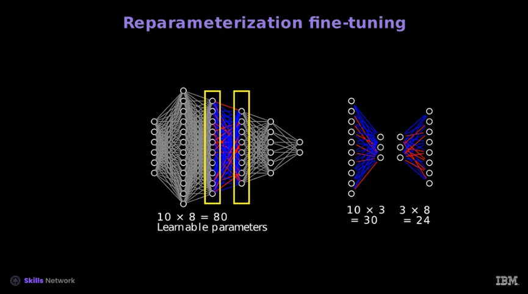

# SFT (Supervised Fine-Tuning)

## Overview
Fine-tuning is the process of adapting a pretrained model (such as a large language model) to a new, task-specific domain.  
There are two major approaches:

1. **Full Fine-Tuning** – updating all parameters in the network.  
2. **Parameter-Efficient Fine-Tuning (PEFT)** – updating only a small portion of parameters while keeping most of the model frozen.  

PEFT has become the standard approach for working with large pretrained models due to its efficiency, scalability, and ability to preserve pretrained knowledge.

---

### Training a Tokenizer (Optional)

In many fine-tuning setups, you can reuse a **pretrained tokenizer** (e.g., BERT’s tokenizer).  
However, if your task involves a **specialized domain** such as medicine, law, or finance, the existing tokenizer may not capture domain-specific terms well.  

In such cases, you may **train a tokenizer on your dataset**. This step is optional, but it helps the model handle domain-specific tokens and improves performance.  

- **When to use**: If your dataset contains specialized vocabulary or tokens not well-represented by the default tokenizer.  
- **When to skip**: If your domain is close to general text and the pretrained tokenizer already covers it well.  

---

## Full Fine-Tuning

- **Definition**: Updates all model parameters, layers, and neurons.  
- **Strengths**: Maximum flexibility and potentially best performance when data and resources are abundant.  
- **Drawbacks**:
    - Requires **massive computational resources** and **GPU memory**.
    - Needs large amounts of **task-specific labeled data**.
    - High risk of **overfitting**.
    - Can lead to **catastrophic forgetting** (loss of general pretrained knowledge).  

Because of these drawbacks, alternative methods (PEFT) were introduced.

---

## Parameter-Efficient Fine-Tuning (PEFT)

PEFT reduces the number of **trainable parameters** while maintaining adaptability to downstream tasks.  
This achieves:  
- Lower compute and memory usage.  
- Faster training and deployment.  
- Stable adaptation without overwriting pretrained knowledge.  

### Categories of PEFT Methods

PEFT methods can be grouped into three main categories:

1. **Selective Fine-Tuning**  
2. **Additive Fine-Tuning**  
3. **Reparameterization-Based Fine-Tuning**  

Some cross-cutting techniques like **soft prompting** also fall into this ecosystem.

---

## 1. Selective Fine-Tuning
- **Idea**: Update only a subset of parameters or layers.  
- **Use Case**: Smaller models or networks where certain layers are most relevant to the new task.  
- **Limitation**: Less effective for transformers because of their highly distributed parameterization.  

---

## 2. Additive Fine-Tuning
Instead of modifying existing weights, new task-specific modules are added.  

### Adapters
- Inserted between **transformer attention blocks**.  
- introduces a low-dimensional bottleneck in a transformer architecture to allow fine-tuning with fewer parameters. It compresses the original high-dimensional embeddings into a lower dimension, applies a non-linear transformation, and then expands it back to the original dimension.
- Structure:
    1. **Down projection** → reduce dimensionality.  
    2. **Non-linear transformation**.  
    3. **Up projection** → restore dimensionality.  
- Only the adapter parameters are trained; the base model remains frozen.  

**Advantages**:
- Modular: adapters can be swapped for different tasks.  
- Efficient: base model can be reused across multiple domains.  

---

## 3. Soft Prompting
Prompts are treated as **trainable parameters** that guide the model’s behavior without altering weights.  

# Hard prompting
Hard prompts involve manually crafted text instructions that guide the model. They are composed of discrete input tokens, which can be effective but require significant effort to design well.

- Example:
To get a model to summarize text, you might use a hard prompt like:
“Summarize the following text: [Text]”

# Soft prompting
Soft prompts, in contrast, use learnable tensors concatenated with input embeddings. These "virtual tokens" are optimized to the data set, providing more efficient and flexible task adaptation.

- Example:
Instead of explicit text ("Summarize the following text:", in this case), a soft prompt involves adjusting input embeddings that subtly guide the model toward generating summaries.

- **Definition**: Learnable embeddings prepended or concatenated to input tokens. So the new learnable embedding is added to the pre-trained ones
- **Variants**:
    - **Prompt Tuning** – optimize a small number of tokens.  
    - **Prefix Tuning** – optimize prefix embeddings across layers. The key distinction is that prefix tuning integrates these parameters across all model layers, unlike prompt tuning, which only modifies the input embeddings.
    - **P-Tuning** – integrates prompts into deeper layers. This optimization is done with a prompt encoder, typically a bidirectional LSTM.
    - **Multitask Prompt Tuning** – share prompts across tasks.  

**Benefit**:  
Fine-tunes a model for new tasks with extremely small memory cost.  

---

## 4. Reparameterization-Based Fine-Tuning
These methods re-express weight matrices using low-rank approximations.

### LoRA (Low-Rank Adaptation)
- Decomposes weight updates into low-rank matrices.  
- Adds small trainable components while freezing the original weights.  
- Captures the most important directions in parameter space.  
- Learnable paramterers (k x r + r x p) < (k x p)
        - r is the rank, so learn two small matrices instead of a big one
- Optimized key, query, and value parameters and is applicable to encoders and ecoders
- LoRA is a general method, but it's commonly applied to the Attention layer

### QLoRA (Quantized Low-Rank Adaptation)
QLoRA extends **LoRA** by combining it with **quantization**, enabling efficient fine-tuning of large language models with significantly reduced memory usage. 

- GPU only 
- Quantization reduces the precision of the numerical values to a finite set of discrete levels, decreasing memory usage and enabling efficient computation on hardware with limited precision. 
- The model's parameters are are stored in 2, 3, 4 or 8-bits as opposed to the usual 32-bits
- **Definition**: It applies low-rank adaptation on top of a quantized base model.  
- **Goal**: Optimize performance while reducing GPU memory requirements by up to **75%**.  
- **Key Techniques**:
    - **Quantization**: Reduces numerical precision to a finite set of discrete levels, lowering memory usage and enabling efficient computation.
        - Example: 3-bit quantization maps values into 8 levels (e.g., -1, -0.75, …, 1).
    - **Double Quantization**: Further compresses storage by quantizing the quantization constants themselves.
    - **Paged Optimizers**: A memory management trick that dynamically loads/unloads parameters to fit large models into limited GPU memory.

**Advantages**:
- Enables fine-tuning of billion-parameter models on smaller GPUs.  
- Retains strong accuracy while drastically lowering resource requirements.  
- Combines the adaptability of LoRA with the efficiency of quantization.  

### Variants
- **QLoRA**: Combines LoRA with quantization → reduces memory footprint further.  
- **DoRA**: Dynamically adjusts the rank based on weight magnitude.  

### Key Concept – Rank:
The rank of a matrix is the number of dimensions the rows of the matrix "live in."  A square matrix is said to be **full rank** if its rank is equal to the number of its rows or columns.
Represents the minimum number of vectors needed to span a space.  

In this scenario, the vectors, despite each having three components, can reach any point on the two-dimensional green plane depicted in the image. These vectors span the green plane, which resides within a two-dimensional subspace. This subspace's dimension, also known as its 'rank', is two—corresponding to the dimensionality of the plane. If the rank were three, any point in the 3D space could be reached by some combination of the columns of $𝐵$. The rank of a matrix can be determined by using the matrix_rank function provided by NumPy.

- In PEFT, low-rank decompositions reduce dimensionality while preserving expressiveness.
- In linear algebra, rank means the number of independent dimensions in a matrix.

---

## Comparing Fine-Tuning Methods

| Method                  | Trainable Parameters | Preserves Pretrained Knowledge | Efficiency | Typical Use Case |
|--------------------------|----------------------|--------------------------------|------------|------------------|
| **Full Fine-Tuning**    | 100%                 | ❌ Risk of forgetting           | ❌ Low     | When abundant data & compute are available |
| **Selective Fine-Tuning** | Small subset         | ✅ Partial                      | ⚠️ Moderate| Simple tasks, smaller models |
| **Adapters (Additive)** | Small new modules     | ✅ Yes                         | ✅ High    | Multi-task setups, modular fine-tuning |
| **Soft Prompting**      | Very small (tokens)   | ✅ Yes                         | ✅ Very High | Lightweight tuning, rapid prototyping |
| **LoRA / QLoRA / DoRA** | Low-rank updates      | ✅ Yes                         | ✅ Very High | State-of-the-art LLM tuning |

---

# UFT (Unsupervised Fine-Tuning)

## Overview
Unsupervised fine-tuning adapts a pretrained model to a new domain using **unlabeled text**.  
The model continues training with its original self-supervised objective (e.g., next-token prediction for LLMs).

Unlabeled data can be used to generate labeled data for like MLM and NSP using libraries from the original data set.

This approach is often used as an **intermediate step** before supervised fine-tuning:  
1. **Start** – pretrained general-purpose model.  
2. **UFT** – adapt to new domain with raw text (no labels).  
3. **SFT / PEFT** – fine-tune on task-specific labeled data.  

---

## Continued Pretraining

- **Definition**: Resume pretraining on domain-specific raw text with the same self-supervised loss.  
- **Strengths**: Expands the model’s vocabulary, style, and knowledge in a domain (e.g., biomedical, legal, or code).  
- **Drawbacks**:
    - Computationally expensive for large models.  
    - Does not directly optimize for downstream task performance.  

---

## Domain-Adaptive Pretraining (DAPT)

- **Idea**: Adapt a model by pretraining it on a large **domain corpus** (e.g., PubMed articles, financial filings).  
- **Use Case**: When the model must understand **specialized jargon** or **domain-specific semantics**.  
- **Limitation**: May still require supervised fine-tuning to align with end tasks.  

---

## Task-Adaptive Pretraining (TAPT)

- **Definition**: Pretrain on the **unlabeled portion of the target dataset** before applying SFT.  
- **Example**: For a sentiment classifier on movie reviews, run unsupervised fine-tuning on all reviews (without labels), then apply supervised fine-tuning on the labeled subset.  
- **Benefit**: Reduces domain mismatch and improves sample efficiency in SFT.  

---

## Parameter-Efficient UFT

Unsupervised fine-tuning can also leverage **PEFT techniques**:  
- **Adapters** – trained on raw text with self-supervised objectives.  
- **LoRA / QLoRA** – low-rank adaptations optimized during domain pretraining.  
- **Soft Prompting** – learn prompts directly from unlabeled corpora.  

**Advantage**: Achieves domain adaptation without updating the entire model.  

---